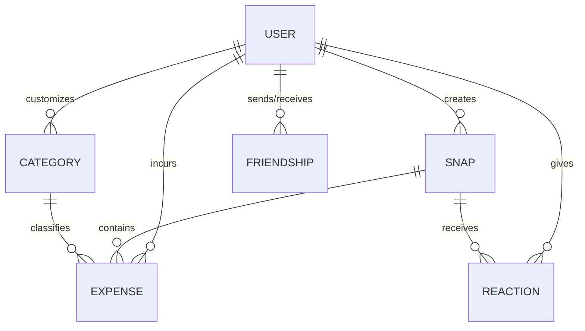

# Mô hình nghiệp vụ & Thuật ngữ (Domain Models & Terminology)

## Từ điển thuật ngữ (Glossary)
* **Daily Snap (Khoảnh khắc hàng ngày)**: Một bức ảnh được chụp bằng camera trong ứng dụng đại diện cho một khoảnh khắc của ngày. Nó phải có caption/ghi chú đi kèm và có thể đính kèm thông tin chi tiêu.
* **Expense (Khoản chi tiêu)**: Một bản ghi giao dịch tài chính gồm số tiền, danh mục, ngày, mô tả và tùy chọn đính kèm hình ảnh.
* **Private Circle / Friend (Bạn bè riêng tư)**: Một người dùng khác đã thiết lập quan hệ bạn bè hai chiều được phê duyệt, cho phép xem các snap được chia sẻ của nhau.
* **Category (Danh mục)**: Nhãn phân loại chi tiêu (ví dụ: Ăn uống, Di chuyển). Gồm danh mục mặc định của hệ thống và danh mục tự tạo của người dùng.
* **Reaction (Tương tác)**: Các biểu tượng cảm xúc (emoji) do bạn bè thả vào các snap được chia sẻ.

---

## Các Entity Nghiệp vụ (Domain Entities)

### 1. User (Người dùng)
Đại diện cho một tài khoản đã đăng ký trong hệ thống.
* **Các thuộc tính**:
  * `id` (UUID, Primary Key)
  * `username` (String, Unique, Required)
  * `email` (String, Unique, Required)
  * `passwordHash` (String, Required)
  * `avatarUrl` (String, Optional)
  * `createdAt` (DateTime)
  * `updatedAt` (DateTime)

### 2. Snap (Khoảnh khắc)
Một bài đăng nhật ký ảnh do người dùng chụp.
* **Các thuộc tính**:
  * `id` (UUID, Primary Key)
  * `userId` (UUID, Foreign Key tham chiếu đến User, Required)
  * `imageUrl` (String, Required)
  * `caption` (String, Optional)
  * `isPrivate` (Boolean, Default: true)
  * `createdAt` (DateTime)
  * `updatedAt` (DateTime)

### 3. Expense (Chi tiêu)
Bản ghi chi tiêu tài chính.
* **Các thuộc tính**:
  * `id` (UUID, Primary Key)
  * `userId` (UUID, Foreign Key tham chiếu đến User, Required)
  * `snapId` (UUID, Foreign Key tham chiếu đến Snap, Nullable)
  * `categoryId` (UUID, Foreign Key tham chiếu đến Category, Required)
  * `amount` (Decimal, Required, Phải > 0)
  * `note` (String, Optional)
  * `date` (Date, Required)
  * `createdAt` (DateTime)
  * `updatedAt` (DateTime)

### 4. Category (Danh mục chi tiêu)
Nhãn phân loại các khoản chi.
* **Các thuộc tính**:
  * `id` (UUID, Primary Key)
  * `userId` (UUID, Foreign Key tham chiếu đến User, Nullable - null nghĩa là danh mục hệ thống mặc định)
  * `name` (String, Required)
  * `color` (String, Optional, mã màu Hex)
  * `icon` (String, Optional)
  * `createdAt` (DateTime)

### 5. Friendship (Quan hệ bạn bè)
Đại diện cho yêu cầu kết bạn và trạng thái kết nối giữa 2 người dùng.
* **Các thuộc tính**:
  * `id` (UUID, Primary Key)
  * `senderId` (UUID, Foreign Key tham chiếu đến User, Required)
  * `receiverId` (UUID, Foreign Key tham chiếu đến User, Required)
  * `status` (Enum: `PENDING`, `ACCEPTED`, `DECLINED`)
  * `createdAt` (DateTime)
  * `updatedAt` (DateTime)

### 6. Reaction (Tương tác cảm xúc)
Emoji do bạn bè thả vào snap được chia sẻ.
* **Các thuộc tính**:
  * `id` (UUID, Primary Key)
  * `snapId` (UUID, Foreign Key tham chiếu đến Snap, Required)
  * `userId` (UUID, Foreign Key tham chiếu đến User, Required)
  * `emoji` (String, Required)
  * `createdAt` (DateTime)

---

## Mối quan hệ giữa các Entity (Entity Relationships)

* **User - Snap**: Quan hệ 1 - Nhiều. Một người dùng có thể tạo nhiều snaps, nhưng mỗi snap chỉ thuộc về một người dùng duy nhất.
* **User - Expense**: Quan hệ 1 - Nhiều. Một người dùng có thể tạo nhiều chi tiêu, nhưng mỗi chi tiêu chỉ thuộc về một người dùng duy nhất.
* **Snap - Expense**: Quan hệ 1 - Nhiều (hoặc 0..1 - Nhiều). Một snap có thể đính kèm không hoặc nhiều chi tiêu. Một chi tiêu có thể liên kết với tối đa một snap.
* **Category - Expense**: Quan hệ 1 - Nhiều. Một danh mục phân loại nhiều chi tiêu.
* **User - Category**: Quan hệ 1 - Nhiều. Một người dùng có thể có nhiều danh mục tự tạo. Các danh mục mặc định có `userId = null` dùng chung cho toàn bộ hệ thống.
* **Snap - Reaction**: Quan hệ 1 - Nhiều. Một snap có thể nhận được nhiều emoji reactions từ bạn bè.
