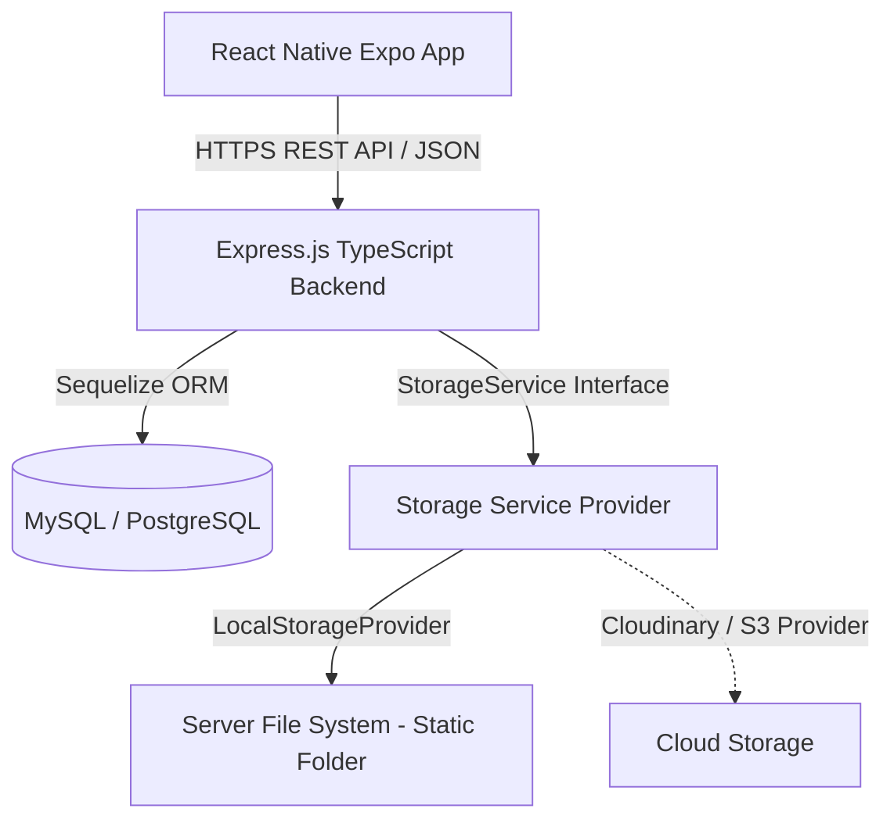
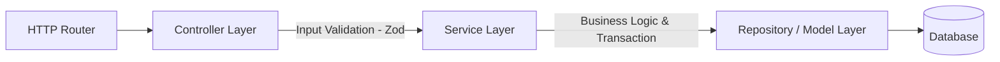

# Kiến trúc hệ thống (Architecture Design)

## Tổng quan kiến trúc hệ thống
Hệ thống DailySnap Expense được thiết kế theo mô hình **Client - Server** sử dụng REST API truyền dữ liệu qua HTTPS.

* **Client**: Ứng dụng di động đa nền tảng (iOS & Android) được xây dựng bằng **React Native Expo** và TypeScript.
* **Server**: Hệ thống Backend API được xây dựng bằng **Node.js Express** và TypeScript.
* **Database**: Cơ sở dữ liệu quan hệ (**PostgreSQL/MySQL**) quản lý thông qua Sequelize ORM.
* **Storage**: Lưu trữ ảnh thông qua một lớp dịch vụ trừu tượng, hỗ trợ lưu trữ cục bộ ở môi trường phát triển và dịch vụ đám mây ở môi trường production.



---

## Kiến trúc Mobile App
Ứng dụng di động được tổ chức theo cấu trúc **Feature-based & Layered Architecture** để đảm bảo khả năng mở rộng:

* **Presentation Layer (UI)**: React Native Components, sử dụng Hook để lấy dữ liệu.
* **State Management (Zustand)**: Quản lý Global State (Session người dùng, Cache dòng thời gian, cấu hình).
* **Service Layer (Axios)**: Thực hiện gọi HTTP requests đến Backend, xử lý interceptors tự động đính kèm và làm mới JWT token.
* **Validation/Types (Zod & TypeScript)**: Đảm bảo dữ liệu form và dữ liệu API nhận được đúng kiểu định dạng.

Cấu trúc thư mục mobile dự kiến:
```text
src/
├── assets/          # Ảnh, font chữ, icons
├── components/      # UI Components dùng chung (Button, Input, Card, v.v.)
├── features/        # Phân chia theo tính năng
│   ├── auth/        # Màn hình đăng nhập, đăng ký, store auth
│   ├── camera/      # Giao diện chụp ảnh snap, xử lý nén ảnh
│   ├── expenses/    # Thêm, sửa, xem chi tiêu
│   ├── timeline/    # Dòng thời gian, bộ lọc
│   └── social/      # Kết bạn, danh sách bạn bè, tương tác snap
├── services/        # Client API, cấu hình Axios
├── store/           # Quản lý state toàn cục (Zustand stores)
└── utils/           # Helper functions (định dạng tiền tệ, ngày tháng)
```

---

## Kiến trúc Backend
Backend được thiết kế theo mô hình **Layered Architecture** (Kiến trúc phân tầng) để phân tách rõ ràng trách nhiệm:



### Chi tiết các lớp (Layers):
1. **Routing Layer**: Định tuyến các HTTPS requests và phân bổ đến các Controller tương ứng. Tích hợp Authentication Middleware và Authorization Middleware.
2. **Controller Layer**:
   - Nhận request, lấy các tham số đầu vào.
   - Sử dụng **Zod** schema để validate định dạng và kiểu dữ liệu.
   - Gọi Service tương ứng và định dạng HTTP Response (DTO) trả về cho Client.
3. **Service Layer**:
   - Chứa toàn bộ **Business Logic** của hệ thống.
   - Quản lý database transaction bằng Sequelize Transaction để đảm bảo tính toàn vẹn dữ liệu khi thực hiện nhiều thao tác ghi đồng thời.
   - Không phụ thuộc trực tiếp vào HTTP Request/Response.
4. **Repository / Model Layer (Sequelize)**:
   - Tương tác trực tiếp với cơ sở dữ liệu qua các Sequelize Models.
   - Thực hiện các câu lệnh truy vấn, JOIN dữ liệu và tối ưu hóa query.

---

## Phân chia Module
Hệ thống được chia thành các module nghiệp vụ độc lập:
* **Auth Module**: Xử lý đăng ký, đăng nhập, cấp và làm mới JWT (Access Token / Refresh Token).
* **User/Profile Module**: Quản lý thông tin cá nhân của người dùng, đổi avatar.
* **Snap Module**: Xử lý chụp ảnh, lưu trữ hình ảnh thông qua `StorageService`, đính kèm ghi chú và lấy danh sách snap.
* **Expense Module**: CRUD các khoản chi tiêu của người dùng.
* **Category Module**: Quản lý danh mục mặc định của hệ thống và danh mục tùy chỉnh của user.
* **Friendship Module**: Tìm kiếm người dùng, gửi/nhận yêu cầu kết bạn, hủy kết bạn.
* **Reaction Module**: Lưu trữ emoji reaction của bạn bè đối với các snap được chia sẻ.

---

## Quy tắc Dependency giữa các Layer
Để tránh lỗi tham chiếu vòng (circular dependencies) và đảm bảo chất lượng, tính phân tách rõ ràng (separation of concerns) của dự án, bắt buộc phải tuân thủ nghiêm ngặt các quy tắc sau:

* **Luồng đi chuẩn**: `Route` $\rightarrow$ `Validation Middleware` $\rightarrow$ `Controller` $\rightarrow$ `Service` $\rightarrow$ `Repository` $\rightarrow$ `Model/Database`.
* **Quy tắc 1 chiều**: Dependency chỉ được đi từ ngoài vào trong. Không được phép gọi ngược (ví dụ: Repository gọi Service hoặc Service gọi Controller).
* **Quy tắc Tách biệt Trách nhiệm**:
  1. **Route Layer**: Nơi định nghĩa các endpoint và gắn các validation middlewares thích hợp.
  2. **Validation Middleware**: Sử dụng Zod schema để validate request data (`body`, `query`, `params`). Tránh validate thủ công trong Controller khi đã có middleware `validateRequest`.
  3. **Controller Layer**: Tiếp nhận dữ liệu sạch đã được validation middleware kiểm chứng, gọi Service và định dạng HTTP Response trả về. Controller **không** được chứa business logic và **tuyệt đối không** được import hoặc gọi trực tiếp Sequelize Model.
  4. **Service Layer**: Nơi tập trung toàn bộ business logic. Service **tuyệt đối không** được import hoặc gọi trực tiếp Sequelize Model để query/write DB. Mọi giao tiếp cơ sở dữ liệu phải thông qua Repository.
  5. **Repository Layer**: Là tầng **duy nhất** được quyền import và gọi các phương thức của Sequelize Model (như `Model.findOne`, `Model.create`, `Model.update`, `Model.destroy`, v.v.).
  6. **DTO & Types**: Các interface/type như DTO nên được tách khỏi Service sang các file riêng (ví dụ: `auth.dto.ts`) nếu chúng được tái sử dụng bên ngoài Service (ví dụ: ở Controller, Validator hay Test) để giữ code Service luôn sạch sẽ và tập trung vào nghiệp vụ.
* **Không gọi chéo Controller**: Một Controller không được gọi sang một Controller khác.
* **Gọi chéo Service**: Trong trường hợp cần thiết, một Service có thể gọi một Service khác để tái sử dụng logic (ví dụ: `SnapService` gọi `ExpenseService`), nhưng phải chú ý tránh circular dependency. Nếu xảy ra, cần tách logic chung ra một Service thứ ba.


---

## Luồng thiết kế chính (Core Flows)

### 1. Luồng Authentication (JWT Flow)
*(Giữ nguyên luồng thiết kế JWT)*

### 2. Luồng tải ảnh và tạo Snap kèm Chi tiêu (Image Upload & Snap Creation Flow)
1. **Client**: Người dùng chụp ảnh bằng camera của thiết bị.
2. **Client**: Sử dụng thư viện `expo-image-manipulator` để nén chất lượng ảnh (quality 0.7 - 0.8) và giảm kích thước chiều rộng/cao về tối đa 1200px để tối ưu dung lượng tải lên.
3. **Client**: Tạo đối tượng `FormData` chứa file ảnh đã nén và các thông số metadata (`caption`, `isPrivate`, và danh sách các khoản chi đính kèm dạng chuỗi JSON string `expenses`).
4. **Client**: Gửi request POST tới `/api/v1/snaps` với header `multipart/form-data` kèm JWT token.
5. **Server (Multer Middleware)**: Bắt file tải lên, băm tên file bằng UUID để tránh trùng lặp.
6. **Server (SnapController)**: Validate dữ liệu text bằng Zod (kiểm tra định dạng chuỗi JSON `expenses` và chuyển đổi sang mảng đối tượng).
7. **Server (SnapService - Database Transaction)**:
   - Sử dụng lớp **`StorageService`** để lưu trữ hình ảnh. Tùy thuộc vào cấu hình, `StorageService` sẽ gọi tới `LocalStorageProvider` để lưu trữ ảnh cục bộ trên ổ đĩa backend hoặc gọi tới `CloudinaryProvider/S3Provider`. Dữ liệu trả về là `imageUrl`.
   - Khởi tạo một **Database Transaction** (Sequelize Transaction).
   - Tạo bản ghi `Snap` trong Database với đường dẫn `imageUrl`.
   - Nếu có mảng `expenses` đi kèm, duyệt qua danh sách và gọi `ExpenseService` để tạo các bản ghi chi tiêu liên kết với `snapId` này, thực hiện hoàn toàn trong cùng transaction.
   - Nếu có bất kỳ lỗi nào xảy ra trong quá trình ghi dữ liệu (ví dụ: danh mục chi tiêu không tồn tại hoặc lỗi ghi dữ liệu), thực hiện **Rollback** toàn bộ transaction để tránh dữ liệu mồ côi (ví dụ: Snap được tạo nhưng không có Expense đi kèm, hoặc ngược lại).
   - Nếu mọi thứ thành công, thực hiện **Commit** transaction và trả kết quả cho Client.

### 3. Chiến dịch Lưu trữ ảnh (Storage Strategy)
Nhằm đơn giản hóa việc phát triển và tích hợp các nhà cung cấp đám mây trong tương lai, hệ thống thiết kế một interface/abstract class **`StorageService`**:
```typescript
interface StorageService {
  uploadImage(file: Express.Multer.File, path: string): Promise<string>; // Trả về imageUrl
  deleteImage(imageUrl: string): Promise<void>;
}
```
* **LocalStorageProvider (MVP)**:
  - Triển khai `StorageService`.
  - Lưu file ảnh tạm thời vào thư mục static trên ổ đĩa server backend (`public/uploads/snaps`).
  - Trả về đường dẫn URL tĩnh của server (ví dụ: `http://localhost:5000/public/uploads/snaps/uuid-filename.jpg`).
* **CloudinaryProvider / AWS S3 Provider (Production)**:
  - Triển khai `StorageService` bằng cách gọi SDK của Cloudinary/AWS S3.
  - Tải file lên đám mây và trả về URL đám mây an toàn.
  - Chỉ cần thay đổi khai báo dependency injection trong module khởi tạo, không ảnh hưởng đến code của `SnapService`.

### 4. Quy tắc Xóa Snap và Expense (Soft Delete Rules)
Hệ thống sử dụng cơ chế **Soft Delete** cho cả `expenses` và `snaps` bằng cách sử dụng cột `deleted_at`.
* **Khi xóa chi tiêu (Expense)**:
  - Cập nhật trường `deleted_at` cho bản ghi chi tiêu đó.
  - Khoản chi tiêu này sẽ không xuất hiện trong các danh sách và biểu đồ thống kê của người dùng.
* **Khi xóa khoảnh khắc (Snap)**:
  - Cập nhật trường `deleted_at` cho bản ghi snap đó.
  - Bản ghi snap này không xuất hiện trên dòng thời gian (timeline) cá nhân hoặc bảng tin bạn bè (friend feed).
  - **Quy tắc liên kết**: Khi xóa snap, **không tự động xóa các expense đã liên kết với snap đó** (tức là không cascade soft delete hoặc set null `snapId` nhưng không xóa expense). Các khoản chi tiêu đính kèm với snap đã xóa vẫn được bảo toàn trong database, tiếp tục xuất hiện trong lịch sử chi tiêu thủ công và được tính vào biểu đồ thống kê tài chính bình thường, ngoại trừ trường hợp chính người dùng chủ động xóa khoản chi tiêu đó.

---

## Chiến dịch Testing (Testing Strategy)
*(Giữ nguyên chiến dịch testing)*

---

## Xử lý lỗi (Error Handling Strategy)
*(Giữ nguyên cơ chế xử lý lỗi)*

---

## Cân nhắc Bảo mật (Security Considerations)
*(Giữ nguyên cân nhắc bảo mật)*

---

## Cân nhắc Hiệu năng (Performance Considerations)
*(Giữ nguyên cân nhắc hiệu năng)*
