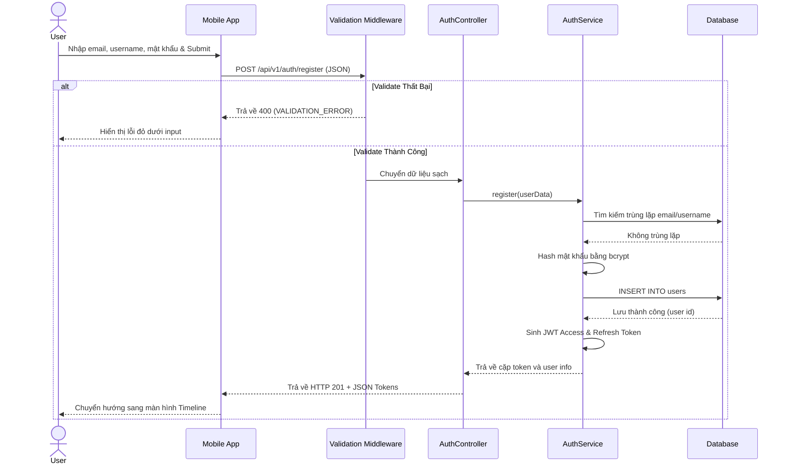
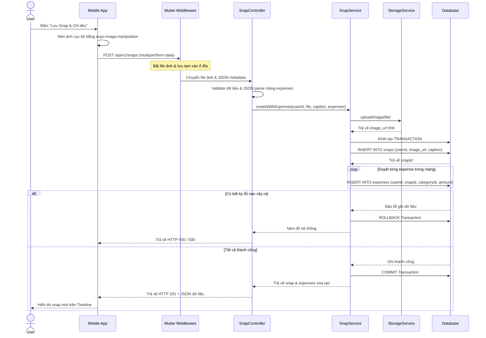

# Chi tiết Luồng Nghiệp vụ (Business Flows)

Tài liệu này đặc tả chi tiết các luồng xử lý chính trong hệ thống DailySnap Expense từ phía giao diện người dùng (UI), cách gọi API, xử lý tại Backend và tương tác Database.

---

## 1. Register/Login Flow (Đăng ký / Đăng nhập)

### Mục tiêu
Khởi tạo tài khoản mới hoặc xác thực người dùng hiện tại để cấp JWT session.

### Actor
Khách (Guest) hoặc Người dùng (User).

### UI Steps
1. Người dùng truy cập màn hình Đăng ký/Đăng nhập.
2. Nhập thông tin (Email, Username, Password).
3. Bấm nút Submit.
4. Hiển thị trạng thái loading.
5. Nếu thành công, chuyển hướng vào màn hình chính.

### API Endpoint
* Đăng ký: `POST /api/v1/auth/register`
* Đăng nhập: `POST /api/v1/auth/login`

### Backend Layers
* **Route**: Định cấu hình endpoint công khai và liên kết `Validation Middleware`.
* **Validation Middleware**: Sử dụng Zod validate định dạng email, độ dài mật khẩu và username.
* **Controller**: Lấy dữ liệu sạch từ request, gọi `AuthService`.
* **Service**: 
  - Đăng ký: Mã hóa mật khẩu qua Bcrypt helper, tạo user mới trong DB, tạo cặp `accessToken` & `refreshToken`.
  - Đăng nhập: Tìm user bằng email/username, so khớp mật khẩu bằng Bcrypt, trả về cặp token.
* **Repository/Model**: Query bảng `users`.

### Database Tables
* `users`

### Business Rules
* Username và Email phải duy nhất.
* Mật khẩu phải được hash bảo mật bằng bcrypt trước khi lưu.

### Error Cases
* `400 BAD_REQUEST`: Email/username đã tồn tại hoặc dữ liệu nhập không đúng định dạng.
* `401 UNAUTHORIZED`: Sai mật khẩu hoặc tài khoản không tồn tại.

### Security Checks
* Không trả mật khẩu hash trong DTO trả về cho client.
* Áp dụng bcrypt salt rounds = 10.

### Sequence Diagram

---

## 2. Refresh Token Flow (Gia hạn phiên)

### Mục tiêu
Tự động làm mới `accessToken` hết hạn mà không gây gián đoạn trải nghiệm của người dùng.

### Actor
Hệ thống (tự động chạy dưới nền ứng dụng di động).

### UI Steps
Không có bước hiển thị trực tiếp. Khi client phát hiện API trả về lỗi `UNAUTHORIZED` do hết hạn token, interceptor của Axios sẽ kích hoạt luồng này.

### API Endpoint
* `POST /api/v1/auth/refresh`

### Backend Layers
* **Route** $\rightarrow$ **Validation Middleware** $\rightarrow$ **AuthController** $\rightarrow$ **AuthService** $\rightarrow$ **Repository/Model**

### Database Tables
* `users` (để kiểm tra xem user còn hoạt động hay đã bị khóa).

### Business Rules
* `refreshToken` phải hợp lệ và chưa hết hạn.
* Nếu `refreshToken` bị thu hồi hoặc hết hạn, người dùng bắt buộc phải đăng nhập lại.

### Error Cases
* `401 UNAUTHORIZED`: Refresh token không hợp lệ hoặc đã hết hạn. Client xóa lưu trữ và đưa người dùng về màn hình Login.

### Security Checks
* Sử dụng thuật toán ký JWT an toàn.
* Lưu `refreshToken` trong `expo-secure-store` trên thiết bị.

---

## 3. Create Expense Flow (Tạo chi tiêu thủ công)

### Mục tiêu
Ghi nhận một giao dịch chi tiêu thủ công không đính kèm hình ảnh.

### Actor
Người dùng (User).

### UI Steps
1. Mở màn hình thêm chi tiêu.
2. Nhập số tiền, chọn danh mục chi tiêu, chọn ngày và viết ghi chú.
3. Nhấn "Lưu".

### API Endpoint
* `POST /api/v1/expenses`

### Backend Layers
* **Route**: Gắn `authMiddleware` và `Validation Middleware`.
* **Validation Middleware**: Validate `amount > 0`, `categoryId` dạng UUID và `date` đúng định dạng.
* **Controller**: Nhận `req.user.id` và gọi `ExpenseService.create()`.
* **Service**: Kiểm tra `categoryId` hợp lệ (thuộc hệ thống hoặc thuộc sở hữu của user), tạo bản ghi chi tiêu mới.
* **Repository/Model**: Ghi dữ liệu vào bảng `expenses`.

### Database Tables
* `expenses`, `categories`

### Business Rules
* Số tiền chi tiêu phải lớn hơn 0.
* Danh mục phải tồn tại và thuộc quyền sở hữu của user hoặc hệ thống.

### Error Cases
* `400 BAD_REQUEST`: Số tiền âm hoặc danh mục không hợp lệ.
* `403 FORBIDDEN`: Cố tình gán chi tiêu vào danh mục tùy chỉnh của user khác.

### Security Checks
* Xác thực JWT bắt buộc.
* Kiểm tra quyền sở hữu đối với danh mục tùy chỉnh.

---

## 4. Create Snap with Expenses Flow (Đăng Snap kèm chi tiêu)

### Mục tiêu
Chụp ảnh khoảnh khắc và đính kèm danh sách chi tiêu đồng thời bằng một hành động.

### Actor
Người dùng (User).

### UI Steps
1. Nhấn nút chụp ảnh $\rightarrow$ Chụp ảnh thành công.
2. Viết caption, chỉnh chế độ riêng tư.
3. Nhập một hoặc nhiều khoản chi tiêu đính kèm.
4. Bấm "Lưu Snap & Chi tiêu".

### API Endpoint
* `POST /api/v1/snaps` (Multipart Form-Data)

### Backend Layers
* **Route**: Gắn `authMiddleware`, `multer` upload image middleware, và `Validation Middleware`.
* **Validation Middleware**: Kiểm tra file ảnh tải lên, validate caption và cấu trúc chuỗi JSON string `expenses`.
* **Controller**: Parse chuỗi JSON string `expenses` thành mảng đối tượng, gọi `SnapService.createWithExpenses()`.
* **Service (Transaction)**:
  - Khởi tạo **Sequelize Transaction**.
  - Lưu ảnh thông qua `StorageService` và nhận `imageUrl`.
  - Tạo bản ghi `Snap` trong Database.
  - Duyệt mảng `expenses`, gọi `ExpenseService` tạo chi tiêu đính kèm `snapId`.
  - Nếu có lỗi phát sinh $\rightarrow$ **Rollback** transaction. Nếu không $\rightarrow$ **Commit**.
* **Repository/Model**: Bảng `snaps`, `expenses`.

### Database Tables
* `snaps`, `expenses`, `categories`

### Business Rules
* Bắt buộc có file ảnh chụp gửi kèm.
* Nếu lưu chi tiêu lỗi thì ảnh snap cũng không được tạo (rollback dữ liệu).

### Error Cases
* `400 BAD_REQUEST`: Thiếu file ảnh hoặc mảng chi tiêu đính kèm sai định dạng.

### Sequence Diagram

---

### Mobile Camera-first Home Flow sau T-14.2.5

Sau khi đăng nhập thành công, app không còn ưu tiên màn Expenses và cũng không tạo Timeline tab riêng. Trải nghiệm authenticated chuyển sang Home camera-first:

1. Người dùng mở app.
2. `useAuthStore.restoreSession()` kiểm tra token.
3. Nếu chưa đăng nhập:
   - Onboarding
   - Login
   - Register
4. Nếu đã đăng nhập:
   - App mở vào Home mặc định.
   - Home hiển thị khung camera bo góc nhỏ gọn ở phần trên.
   - Camera là hành động chính để tạo snap.
   - Người dùng chụp ảnh.
   - Ảnh được nén nội bộ.
   - Preview cho phép nhập caption, chọn privacy và đính kèm quick expenses.
   - Preview không hiển thị bảng so sánh thông số nén cho người dùng.
   - Lưu snap gọi `POST /snaps` multipart/form-data.
   - Sau khi lưu thành công, app refresh Home Feed và Expenses nếu cần.
5. Người dùng có thể cuộn xuống dưới Home để xem Feed.
6. Feed hiển thị snap của chính mình và snap public/phù hợp quyền xem từ bạn bè, sắp xếp theo giờ đăng mới nhất trước.
7. Memories/Kỷ niệm dùng để xem lại snap theo ngày/tháng.
8. Expenses là khu vực phụ trợ để xem danh sách chi tiêu đã tạo từ snap hoặc nhập thủ công.
9. Profile là nơi quản lý tài khoản, logout và các tính năng social/profile sau này.

`App.tsx` chỉ giữ root providers và navigator. Không tiếp tục mount màn hình mới bằng local state tạm trong `App.tsx`.

### Camera Flow chính thức

- Người dùng mở app vào Home.
- Home có camera card bo góc nhỏ gọn, không fullscreen toàn bộ màn.
- CameraScreen hoặc CameraHome component xử lý permission, chụp ảnh và nén ảnh.
- Preview snap xử lý caption, privacy và quick expenses.
- Preview không hiển thị bảng so sánh kích thước/dung lượng ảnh cho người dùng.
- Sau khi save thành công:
  - refresh Home Feed
  - refresh Expenses nếu snap có expenses đính kèm
  - điều hướng về Home hoặc giữ tại Home tùy UX của task hiện tại.

---

## 5. Timeline Flow (Dòng thời gian cá nhân)

### Mục tiêu
Hiển thị lịch sử ảnh snap và chi tiêu đính kèm sắp xếp theo ngày của người dùng hiện tại.

### Actor
Người dùng (User).

### UI Steps
1. Người dùng mở tab Timeline.
2. Timeline tự động load danh sách (hiển thị skeleton loading).
3. Người dùng cuộn dọc để xem hoặc lọc theo ngày/tìm kiếm từ khóa.

### API Endpoint
* `GET /api/v1/snaps/timeline`

### Backend Layers
* **Route** $\rightarrow$ **AuthController** $\rightarrow$ **SnapService** $\rightarrow$ **Repository/Model**

### Database Tables
* `snaps`, `expenses`, `categories`

### Business Rules
* **Bắt buộc loại trừ** các snaps đã bị soft delete (`snaps.deleted_at IS NOT NULL`).
* Sắp xếp theo thứ tự thời gian mới nhất lên trên.

### Security Checks
* Người dùng chỉ được xem snaps và chi tiêu của chính họ sở hữu.

---

## 6. Delete Snap Flow (Xóa Snap)

### Mục tiêu
Xóa ảnh snap khỏi timeline nhưng vẫn giữ lại các khoản chi đính kèm để làm báo cáo tài chính.

### Actor
Người dùng (User).

### UI Steps
1. Nhấp vào nút xóa (thùng rác) trên thẻ Snap.
2. Hiển thị thông báo xác nhận: *"Xóa ảnh này sẽ giữ lại các khoản chi tiêu liên quan. Bạn có muốn tiếp tục?"*.
3. Bấm xác nhận xóa $\rightarrow$ Snap biến mất khỏi Timeline.

### API Endpoint
* `DELETE /api/v1/snaps/:id`

### Backend Layers
* **Route** $\rightarrow$ **Validation Middleware** $\rightarrow$ **SnapController** $\rightarrow$ **SnapService** $\rightarrow$ **Repository/Model**

### Database Tables
* `snaps`, `expenses`

### Business Rules
* Snap bị xóa mềm (`deleted_at = NOW`).
* Các bản ghi `expenses` có liên kết `snap_id` **vẫn được giữ nguyên** trong DB (không set null, không xóa mềm expense).
* Trên UI danh sách chi tiêu, các khoản chi liên kết này hiển thị kèm nhãn *"Ảnh nhật ký đã bị xóa"*.

### Security Checks
* Chỉ chủ sở hữu snap (`userId` khớp) mới có quyền xóa snap.

---

## 7. Friend Request Flow (Yêu cầu kết bạn)

### Mục tiêu
Gửi lời mời kết nối riêng tư với người dùng khác.

### Actor
Người dùng gửi (Sender) và Người dùng nhận (Receiver).

### UI Steps
1. Người dùng A tìm kiếm người dùng B bằng email/username.
2. Bấm nút "Gửi lời mời kết bạn".
3. Người dùng B nhận thông báo và vào tab Bạn bè chấp nhận lời mời.

### API Endpoint
* Gửi lời mời: `POST /api/v1/friends/request`
* Chấp nhận/Từ chối: `PUT /api/v1/friends/request/:id`

### Backend Layers
* **Route** $\rightarrow$ **Validation Middleware** $\rightarrow$ **FriendshipController** $\rightarrow$ **FriendshipService** $\rightarrow$ **Repository/Model**

### Database Tables
* `friendships`, `users`

### Business Rules
* Không được tự gửi lời mời kết bạn cho chính mình.
* Chỉ thiết lập trạng thái kết bạn hai chiều (`ACCEPTED`) mới có quyền xem private feed của nhau.

### Security Checks
* Ràng buộc unique index chống gửi trùng lặp lời mời.

---

## 8. Friend Feed Flow (Bảng tin bạn bè)

### Mục tiêu
Hiển thị các khoảnh khắc (snaps) được chia sẻ công khai bởi vòng bạn bè.

### Actor
Người dùng (User).

### UI Steps
1. Người dùng chuyển sang tab Social / Friend Feed.
2. Xem danh sách các snap của bạn bè được chia sẻ kèm theo emoji reaction.

### API Endpoint
* `GET /api/v1/friends/feed`

### Backend Layers
* **Route** $\rightarrow$ **FriendshipController** $\rightarrow$ **FriendshipService** $\rightarrow$ **Repository/Model**

### Database Tables
* `snaps`, `friendships`, `reactions`, `users`

### Business Rules
* Chỉ lấy các snaps của bạn bè có trạng thái kết bạn `status = 'ACCEPTED'`.
* **Bắt buộc loại trừ** các snaps bị xóa mềm hoặc snaps được cấu hình chế độ `isPrivate = true`.

---

## 9. Reaction Flow (Tương tác cảm xúc)

### Mục tiêu
Thả emoji reaction tương tác nhanh vào snap của bạn bè.

### Actor
Người dùng (User).

### UI Steps
1. Trên bảng tin bạn bè, nhấp chọn emoji có sẵn hoặc bấm nút "+" để chọn emoji khác.
2. Emoji xuất hiện trên góc ảnh snap.

### API Endpoint
* `POST /api/v1/snaps/:id/react`

### Backend Layers
* **Route** $\rightarrow$ **Validation Middleware** $\rightarrow$ **ReactionController** $\rightarrow$ **ReactionService** $\rightarrow$ **Repository/Model**

### Database Tables
* `reactions`, `snaps`, `friendships`

### Business Rules
* Người dùng chỉ có quyền thả reaction vào snap của người dùng khác khi cả hai đã thiết lập bạn bè `ACCEPTED` và snap đó ở chế độ public (`isPrivate = false`).

---

## 10. Statistics Flow (Thống kê tài chính)

### Mục tiêu
Tổng hợp dữ liệu chi tiêu trực quan thành số liệu và biểu đồ xu hướng.

### Actor
Người dùng (User).

### UI Steps
1. Mở màn hình Thống kê.
2. Xem tổng chi tiêu ngày/tháng, xem biểu đồ tròn danh mục và xem biểu đồ xu hướng đường/cột.

### API Endpoint
* `GET /api/v1/statistics`

### Backend Layers
* **Route** $\rightarrow$ **StatisticsController** $\rightarrow$ **StatisticsService** $\rightarrow$ **Repository/Model**

### Database Tables
* `expenses`

### Business Rules
* **Bắt buộc loại trừ** tất cả các khoản chi tiêu đã bị soft delete (`expenses.deleted_at IS NOT NULL`) khỏi các phép toán SUM, COUNT hoặc GROUP BY.
* Chỉ tính toán trên các khoản chi thuộc sở hữu của chính người dùng đăng nhập.
